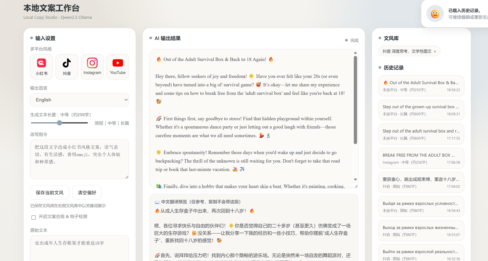
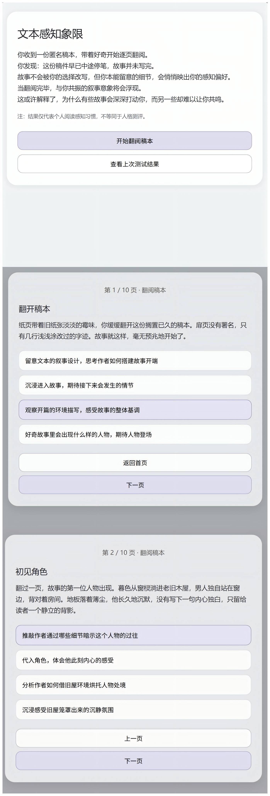

# 个人作品集｜出海内容与 AIGC 工具原型

> 立足俄语本土用户洞察与新闻学内容功底，探索 AIGC 赋能出海社媒内容生产，用可落地原型验证多语言内容自动化创作思路。

## 关于我

俄语 + 新闻学双非硕士，俄语专四 91 分、专八；2 年俄罗斯孔子学院海外任教经历，熟悉俄语本土文化与 VK 等俄语社媒用户语境，深耕跨文化内容本地化。

具备 AIGC 原型落地经验，独立完成 AI 社媒文案工具（本地大模型驱动），探索大模型在出海营销内容生产的落地应用；拥有记者、内容运营实习经历，擅长内容选题策划、文案撰写与传播效果复盘。

**求职方向**：出海跨境电商俄语区海外社媒运营 / 全球化内容运营（杭州 / 上海，优先双休）

## 项目速览

|项目|一句话介绍|状态|
|---|---|---|
|本地文案工作台|多平台、多语言 AI 文案改写工具（Flask + Ollama 本地运行）|可用原型，**线上仅可预览前端 UI**|
|文学叙事意象四象限测试|阅读偏好测评，2D 四象限 + 文学引文卡片|约 40%，持续迭代|

## 项目一：本地文案工作台（Local Copy Studio · Qwen2.5 Ollama）

面向出海社媒内容创作的多平台 AI 文案改写工具，5 天完成多版本迭代。

**核心功能**
- 多平台风格：小红书、抖音、Instagram、YouTube 等平台文案风格一键生成
- 多语言输出：支持中文 / 英语 / 俄语等语言输出，附中文翻译预览
- 长度档位：简短（约 80 字）/ 中等（约 250 字）/ 长篇（约 600 字）
- 改写指令：自定义改写要求（语气、emoji、种草感、叙事风格等）
- 文风库：保存常用文风，一键复用
- 历史记录：按平台 / 长度 / 时间留存，可继续编辑或重新生成
- 其他：文案合规与钩子检测、复制生成文案功能

**技术方案**
> ⚠️ 后端 Flask + Ollama Qwen2.5-7B **仅本地电脑运行**；GitHub Pages 只托管静态前端页面，网页无法执行 AI 生成。
前端页面（HTML+CSS+JS） + Flask 后端 + Ollama Qwen2.5-7B（本地部署）

**迭代过程**
纯前端静态 Demo（多风格模板 + 钩子强度滑块）
→ 接入 Flask + Ollama 本地大模型
→ 扩展为完整文案工作台（文风库 / 历史记录 / 合规检测 / 多语言输出）

**局限与复盘**
- 完整生成能力依赖本地 Ollama 环境，公网无法直接演示生成效果
- 预设文风库与模板数量有限，AI 生成输出仍需要人工本地化校对
- 迭代计划：搭建俄语电商行业词库、优化提示词体系、完善钩子与合规检测

**项目收获**
提示词工程实践；理解大模型在俄语出海内容生产的能力边界；快速原型迭代思维；区分原型 Demo 和商用产品之间的差距。

## 项目二：文学叙事意象四象限测试（文本感知象限）

一个文学叙事风格测评工具：用户完成选择题，根据阅读偏好得到 2D 四象限坐标落点，展示对应的文学引文卡片。

**设计**
- X 轴：解构 ↔ 沉浸（阅读姿态，范围 -100 至 100）
- Y 轴：聚焦人物 ↔ 聚焦氛围（阅读注意力落点，范围 -100 至 100）
- 四象限：解构-人物 / 沉浸-人物 / 解构-氛围 / 沉浸-氛围

三层数据架构解耦：
1. 🔒 底层内核：16 组叙事意象标签固定坐标（定稿不再修改）
2. 📖 素材库：16 条文学引文卡片，可独立更新引文与出处，**不改动测评计算逻辑**
3. 📝 测验包装层：题目文本可自由改写迭代，不影响底层计算。

**技术方案**
原生 HTML + JavaScript + Tailwind CSS，LocalStorage 浏览器本地存储，纯静态单页、无后端，可直接双击打开运行。

**当前进度（约 40%）**
✅ 已完成：底层坐标与四象限设计、测验题目框架、页面基础交互、本地存储逻辑
⏳ 待完成：页面布局调整、测试文本叙事基调改写、16 个结果配图资源、原创文学意象片段撰写

**项目收获**
用户洞察、叙事内容设计、前端快速原型落地、分层解耦的数据架构设计思维。

## 技能清单

- 语言：俄语专四 91 分、专八；中文深度文案、内容策划
- AIGC：提示词工程、多语言 AI 内容生产、本地大模型 Ollama 调用
- 工具：Vibe Coding、基础 Flask、原生 HTML / JS、Canva、剪映
- 行业认知：VK 俄语社媒生态、内容选题、文案本地化、内容数据复盘

## 联系方式
> 公开仓库，不填写手机号，保护个人隐私
邮箱：____
GitHub：https://github.com/findafinejobnow

## 免责声明
1. 本仓库全部项目为个人学习、求职展示 Demo。
2. 文学引文均选用公有领域公版作品。
3. AI 生成内容仅供参考，如果商用必须经过人工本地化校对。