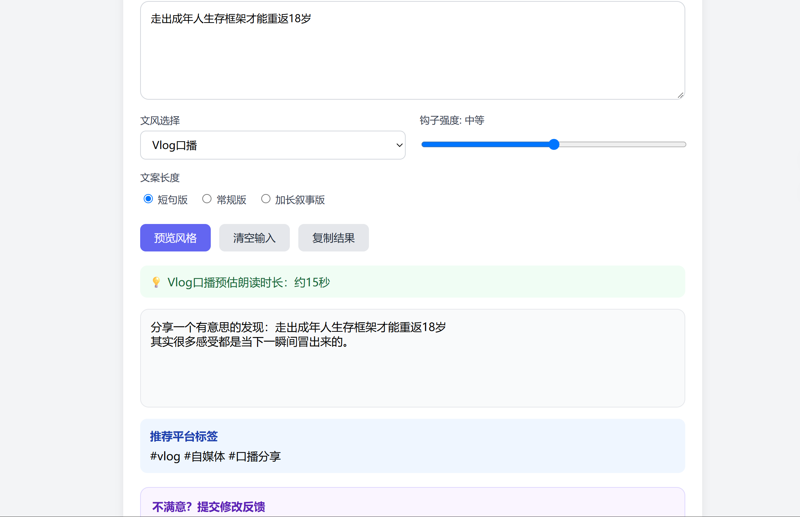

# 文本风格预览小工具 | 跨文化自媒体文案交互原型
> 作品集项目：AI生成多平台社媒文案，支持中文小红书风格，扩展俄语VK社媒文案生成模块。前端网页 + Flask后端 + Ollama本地大模型。

🔗 在线预览：https://findafinejobnow.github.io/portfolio/text-style-preview/ai-text-preview/
> 🚧 当前状态：线上部署版本为纯前端 UI，仅做模拟生成演示；Flask + Ollama 本地后端正在开发，在本机部署 Ollama Qwen2.5:7b 后，可接入 API 实现真实 AI 文案生成。

## ✨ 项目亮点
1. **多风格预设模板**：内置5种自媒体文风
    - 小红书钩子风｜简洁干货风｜故事叙事风
    - VK俄系社媒风格｜Ins英文短文案风格
2. **双参数可控生成**
    - 钩子强度滑块：温和 / 中等 / 强钩子
    - 文案长度选项：短句版 / 常规版 / 加长叙事版
3. **本地存储历史记录**：自动保存最近5条生成记录，浏览器刷新不丢失，支持一键回填参数与原文
4. **关键词高亮**：自动提取原文核心关键词并高亮，直观展示文本抓取逻辑
5. **模拟AI交互体验**：点击生成带有Loading淡入动画，搭配优雅Toast复制成功提示
6. **响应式页面**：电脑、手机均可正常打开使用
7. **单文件项目**：全部代码集成在 `index.html`，无需依赖外部CDN，开箱即用

## 📸 页面预览

## 🚀 快速启动
1. 下载项目文件，本地打开 `index.html`
2. 在输入框粘贴需要改写的原文
3. 选择文风、钩子强度、文案长度
4. 点击【预览风格】生成改写文案
5. 支持一键【复制结果】、【清空输入】；历史记录区域可以点击复用过往任务

## 📂 项目文件结构
